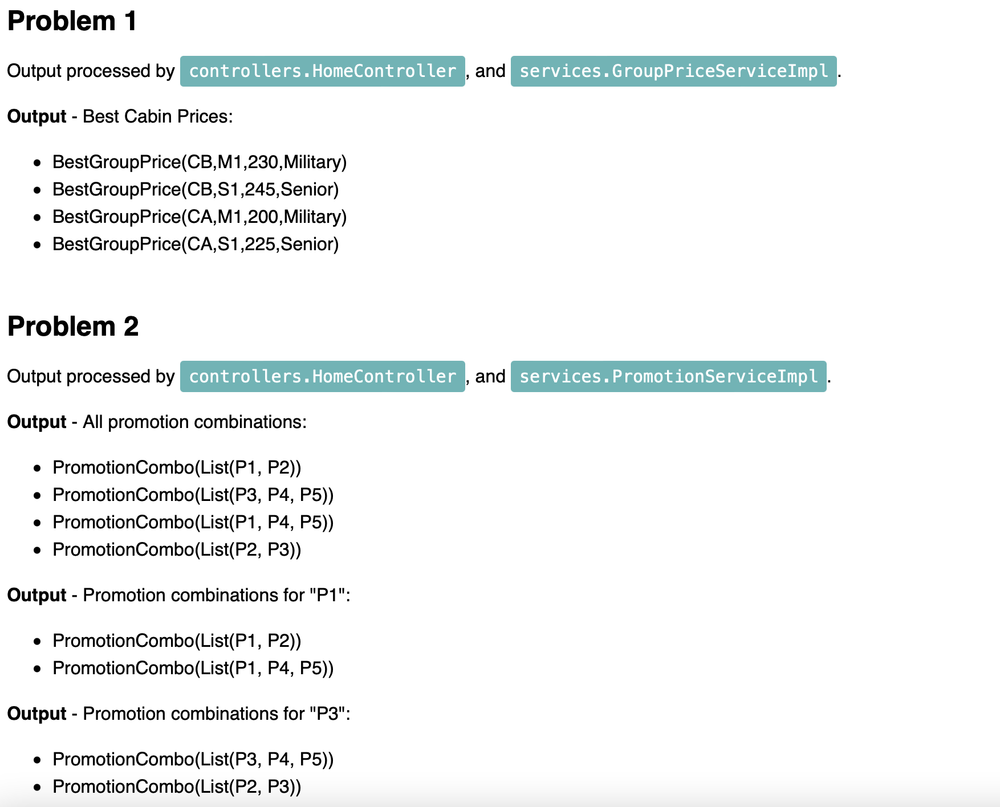
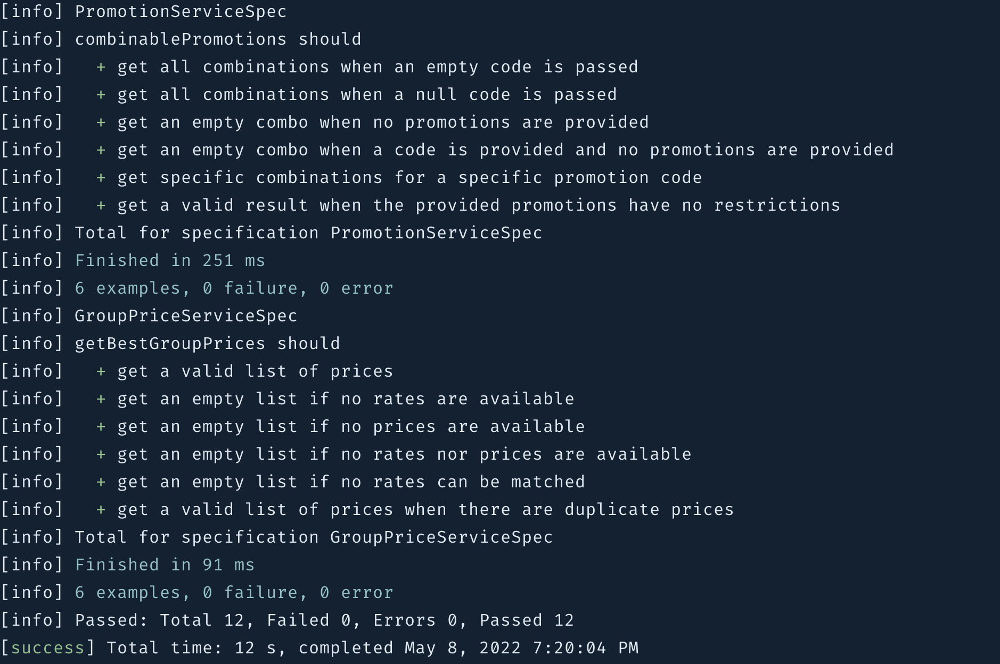

# TST Programming Exercise

This is a standard Play 2.8 application, built using Scala 2.13 and Java 8. The program uses `sbt` for compiling, running and testing. 

## Run the program

```
sbt run
```

Open a browser and go to http://localhost:9000

## Run the tests

```
sbt test
```

## Sample outputs

The following page is displayed during execution:



The following results are displayed for test execution:


